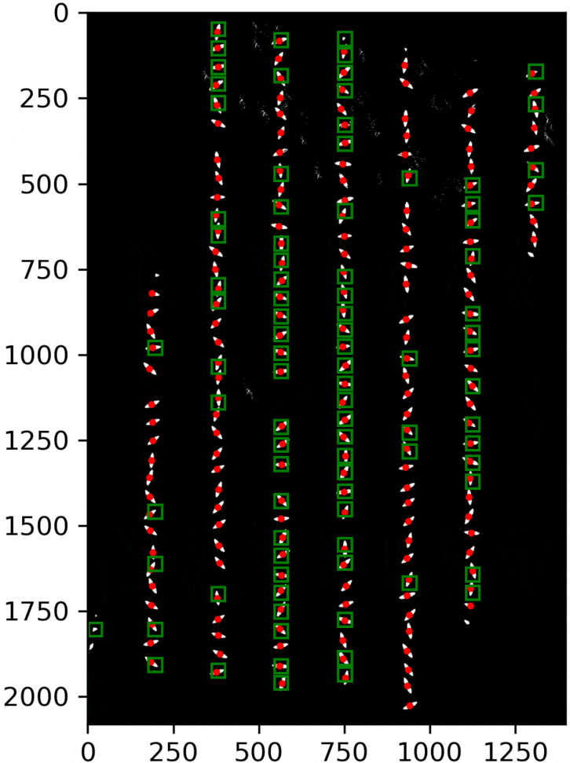

# Instructions

## Dependencies 
Here are some special dependencies that are typically not included by default in Anaconda.
- [Pillow](https://anaconda.org/anaconda/pillow)
- [PyClustering](https://anaconda.org/conda-forge/pyclustering)
- [Scikit Learn](https://anaconda.org/anaconda/scikit-learn)
- [Scikit Image](https://anaconda.org/anaconda/scikit-image)
- [OpenCV](https://anaconda.org/conda-forge/opencv)

The full list of requirements is availalble [here]("https://github.com/LittleCoinCoin/Plant_Counting/blob/Release/requirements.txt") (hanks to @ef1rspb in [#2](https://github.com/LittleCoinCoin/Plant_Counting/pull/2)). It can be installed via: `pip3 install -r ./requirements.txt`

## Datasets
Some sample data is available in the folders */Data/Non-Labelled/* and */Data/Labelled*. There are two sets (*Set 1* and *Set 2*) for the non-labelled data and one for the labelled data (*Set 3*). Results of the method for *Set 1* and *3* are available for your consultation in */Output_General*.
The images are synthetic and were generated with [our custom generator](https://github.com/LittleCoinCoin/HDRP_PGoCF).
Although the synthetic images we generate are automatically labelled (that's the point of synthetic data, right?), we 
removed the labels for *Set 1* and *Set 2* to do as if we were dealing with freshly acquired images of a real crop field captured by a UAV. 

## Description
In this tutorial, we will run the pre-processing and the 2 steps detection method on the images.
These three processes can be run separately (__but in this exact order__) with the scripts *[Process_image_for_FT.py](../Pre_Treatments/Process_image_for_FT.py)*, *[FrequencyAnalysis.py](../Fourier/FrequencyAnalysis.py)* and *[Multi_Images_Simulation.py](../MAS/Multi_Images_Simulation.py)*. Alternatively, you can use the script *[WholeProcess.py](../Whole_Process/WholeProcess.py)* to run everything in one goe. You can refer to the [documentation](../Documentation/) for more information about the parameters accessible.

You can run each script for labelled images or non-labelled images. Examples on how to use the relevant functions and working parameter values are available at the end of each script. But, if you directly run each script without checking the content, the code will run on the labelled images (*Set 3*) by default. You can run on the non-labelled images (*Set 1*) by decommenting the corresponding lines at the end of each scripts. 
You can, of course, also replace the paths parameters to point to a folder containing your own images.

## Known Limitations
However, the crop rows of all images __MUST__ be oriented in the same direction. Also, the crop rows __SHOULD NOT__ exhibit obvious curves at the scale of the image. We also discourage applying our method on a mosaïc image representing a complete field. Instead, we recommend tilling it into smaller chunks; an image size around 2000x2000 pixels runs fine on our end but it ultimately depends on the performances of your machine. 

Similarly, the current version of [our custom generator](https://github.com/LittleCoinCoin/HDRP_PGoCF) can generate both linear and curved fields. So, if you want to generate more images for tests, be careful to only generate linear crop rows.

## Pre-processing
Run *[Process_image_for_FT.py](../Pre_Treatments/Process_image_for_FT.py)*

During the pre-processing, the images will be i) segmented using an Otsu segmentation; ii) rotated so that
the crop rows are vertically oriented; iii) filtered to extract the skeleton of the crop rows ([BSAS](https://pyclustering.github.io/docs/0.9.0/html/db/d8b/classpyclustering_1_1cluster_1_1bsas_1_1bsas.html)
method).

Results are found in the folder */Output*. The segmented image are in the */Otsu* folder and their rotated
counter part are in the folder */Otsu_R*. Images of the skeletton of the crop rows are saved only if the 
parameter *_save_BSAS_images=true*.

## Approximation of the geometry of the crop field
Run *[FrequencyAnalysis.py](../Fourier/FrequencyAnalysis.py)*

The goal of this step is to detect the crop rows and approximate the position of the target plants.
We do so by performing a Fourier analysis of the histograms resulting of the projections on the X and
Y axis of the white pixels of the Otsu images.

Results are in the folder */Output_FA*. They are json files containing the position of the predicted plants
for each crop row.

## Detecting the plants (refining the approximation)
Run *[Multi_Images_Simulation.py](../MAS/Multi_Images_Simulation.py)*

During this step, the Multi-Agents System is initialized based on the approximation made by the Fourier Analysis.
Should the detection results be very bad for your own set of images, please start by altering the parameter 
*_RAs_group_size* ([doc](https://github.com/LittleCoinCoin/Plant_Counting/blob/Pre-Release/Documentation/MAS/Multi_Images_Simulation_v12bis.md)).

### Results files 
The results are in the folder */Output_Meta_Simulation*.
- The file **MetaSimulationResults_\*** summarizes the detection results. It is a json file which you can open with [general_IO.ReadJson()](https://github.com/LittleCoinCoin/Plant_Counting/blob/Release/Utility/general_IO.py#L145)( `general_IO.ReadJson()` returns a dictionary). The json has the name of the source rgb image for key and the simulation data as value. The structure is as follow: 
    ```
    {
        name_of_rgb_source_image:
        {
            "Time_per_steps": list[float] if the time in second that each step took,
            "Time_per_steps_detailes": list[list[float]]. For each step, we record the time taken by specific parts of the code,
            "Image_Labelled": bool. True if the user ran themethod on synthetic data or labelled images; false otherwise.
            "NB_labelled_plants": int. The real number of plants on the image if it was labelled.
            "NB_RALs": int. the number of plants detected by the method
            "TP": int. True Positives. Only if the user ran the method on synthetic data or labelled images. 0 by default.
            "FN": int. False Negatives. Only if the user ran the method on synthetic data or labelled images. 0 by default.
            "FP": int. False Positives. Only if the user ran the method on synthetic data or labelled images. 0 by default.
            "InterPlantDistance": int. The estimated inter-plant distance in pixel.
            "RAL_Fuse_Factor": float. This is the parameter of the same name in the simulation.
            "RALs_fill_factor": float. This is the parameter of the same name in the simulation.
            "RALs_recorded_count": list[int]. The number of plants at each step of the simulation.
        }
    }
    ```

- In the folder */RALs_NestedPositions_\**, you can find one json file per image. Each file stores the positions of the plants per crop row. The file do not contain any key fields, is directly stores the list of positions. Same as above, the file can be opened using [general_IO.ReadJson()](https://github.com/LittleCoinCoin/Plant_Counting/blob/Release/Utility/general_IO.py#L145).  The structure is as follow:
    ```
    list_Root[
        ...,
        list_CropRow_i[
            ...
            list_PlantCoord_j[float_X, float_Y],
            ...
            ],
        ...
        ]
    ```


### Visualize the steps of the simulation
Run *[Single_Image_Simulation.py](../MAS/Single_Image_Simulation.py)*

By default *[Single_Image_Simulation.py](../MAS/Single_Image_Simulation.py)* paths variables point to *Set 3*. If you do not use this data, you __MUST__ perform the [pre-processing](#pre-processing) and [Fourier analysis](#approximation-of-the-geometry-of-the-crop-field) steps before trying to run it.
Indeed, the vertically adjusted Otsu images (in folder */Output/Session_1/Otsu_R*) and the predictions of the Fourier Analysis (in folder */Output/Output_FA/Session_X/Plant_FT_Predictions*) should exist for the MAS to run.

Here are a few relevant variables in the script that you may want to adapt:
- *labelled_image*: Set to True if you want to provide the labelling data associated with an image. False if you don't give any.
- *subset_size*: The number of image you want to load from the dataset. Sometimes, datasets are quite large so, to avoid loading the whole image dataset, it is possible to limit the loading to the k first images.
- *_image_index*: Specifies which image of the subset you want to run the MAS on.
- *follow_bool*: Set to True if you want to save the images to follow the movements of the agents that are      looking for the plants. False, otherwise. If True, this can help understand the flow of the method and tune the parameters' values for the MAS (in particular *_RAs_group_size*). Each image have standardized names.
    - __"*SimulationName*\_A"__ is the initial positions of the agents (the rough estimate from the Fourier analysis).
    - __"*SimulationName*\_B"__ is the image after the edge exploration of the rows.
    - __"*SimulationName*\_C\_*stepindex*\_1"__ is the image of after the Reactive Agent Leaders (RALs, the agents looking for plants) moved toward their active point (the white pixels they see).
    - __"*SimulationName*\_C\_*stepindex*\_2"__ is the image after the RALs have adapted their size
    - __"*SimulationName*\_C\_*stepindex*\_3"__ is the image after the RALs have been fused is too close from each other or further RALs have been instantiated to fill the detected gaps.
    - __"*SimulationName*\_C\_*stepindex*\_4"__ is the image after the RALs that didn't detect enough white pixels were destroyed.

    There is no function in the code to generate a gif from the images. Instead, I used [https://ezgif.com](https://ezgif.com) to generate the following: 

- *show_labelled_plant_positions*: Set to True if you want to see the position of the target plants as red points. False, otherwise. Has an effect only if *labelled_image* and *follow_bool* are both set to True as well.
-*path_output_follow*: The path where the images will be saved if *follow_bool* is set to True. By default, the last directory of the path use values of the MAS parameters so that the images are saved in different folders if they are changed.

Every parameter of the MAS can be changed with the variables *RAs_group_size*, *RAs_group_steps*, *Simulation_steps*, *RALs_fuse_factor*, *RALs_fill_factor*. See the [doc](https://github.com/LittleCoinCoin/Plant_Counting/blob/Pre-Release/Documentation/MAS/Multi_Images_Simulation_v12bis.md) for more details about what they do.